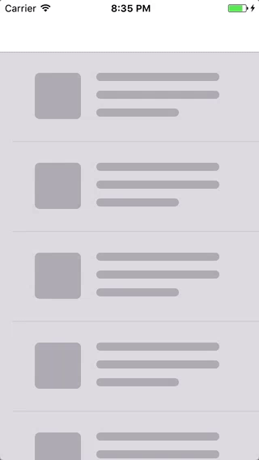

# RainyRefreshControl

[](https://developer.apple.com/swift/)
[](https://img.shields.io/cocoapods/v/RainyRefreshControl.svg)
[](https://github.com/Carthage/Carthage)
[](https://developer.apple.com/swift/)
[](https://developer.apple.com/swift/)

Simple refresh control for iOS based on SpriteKit and Core Graphics.

Project inspired by [concept](https://dribbble.com/shots/2242263--1-Pull-to-refresh-Freebie-Weather-Concept) of [Yup Nguyen](https://dribbble.com/yupnguyen)



## Installation

### Installation with CocoaPods

To integrate RainyRefreshControl into your Xcode project using CocoaPods, specify it in your `Podfile`:

```ruby
source 'https://github.com/CocoaPods/Specs.git'
platform :ios, '9.0'

target 'TargetName' do
pod 'RainyRefreshControl'
end
```

Then, run the following command:

```bash
$ pod install
```

### Installation with Carthage

[Carthage](https://github.com/Carthage/Carthage) is a decentralized dependency manager that builds your dependencies and provides you with binary frameworks.

You can install Carthage with [Homebrew](http://brew.sh/) using the following command:

```bash
$ brew update
$ brew install carthage
```

To integrate RainyRefreshControl into your Xcode project using Carthage, specify it in your `Cartfile`:

```ogdl
github "Onix-Systems/RainyRefreshControl"
```

Run `carthage update` to build the framework and drag the built `RainyRefreshControl.framework` into your Xcode project.

## Usage

Just import RainyRefreshControl framework into your class and add it to UITableView or UICollectionView:

```swift
let refresh = RainyRefreshControl()
refresh.addTarget(self, action: #selector(ViewController.doRefresh), for: .valueChanged)
tableView.addSubview(refresh)

```

## Who's behind this?

[Onix-Systems](https://onix-systems.com) is a front end and back end development and mobile application development company bringing expert execution, situated in Ukraine.

[](https://onix-systems.com)

## License

RainyRefreshControl is released under the MIT license. See [LICENSE](LICENSE) for details.
